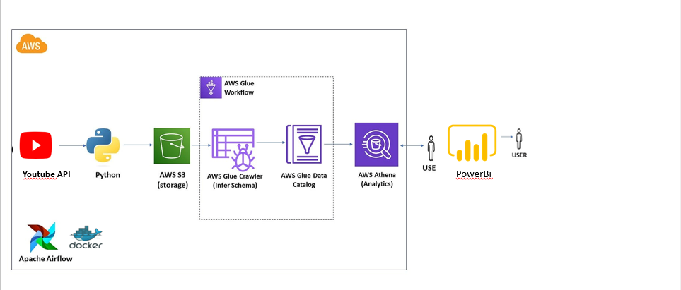
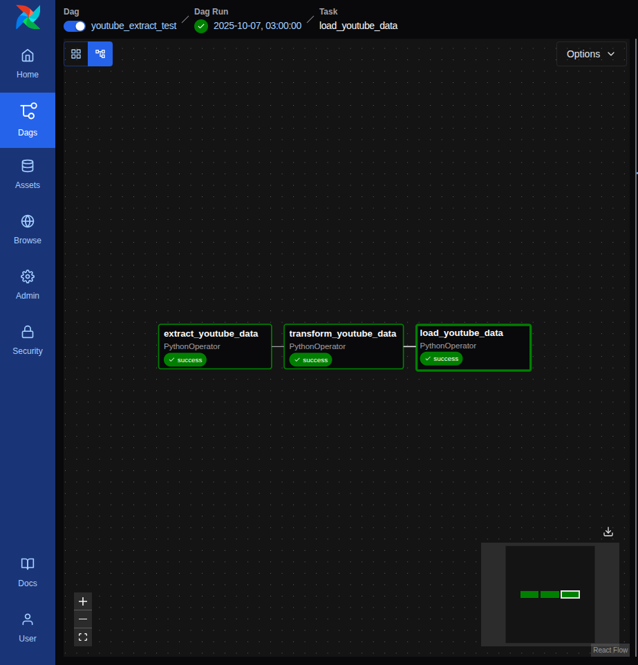
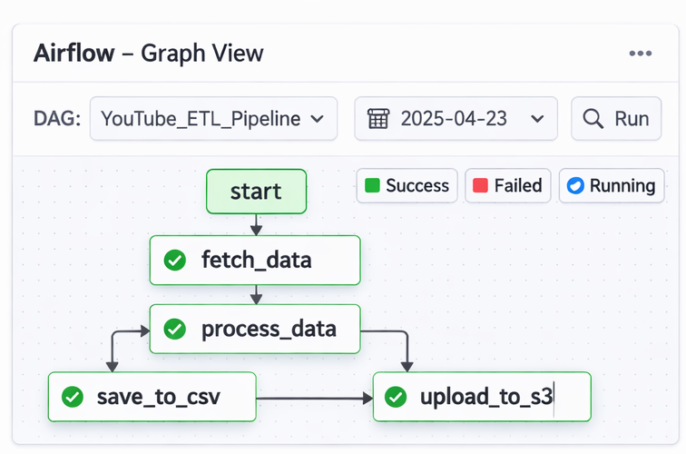
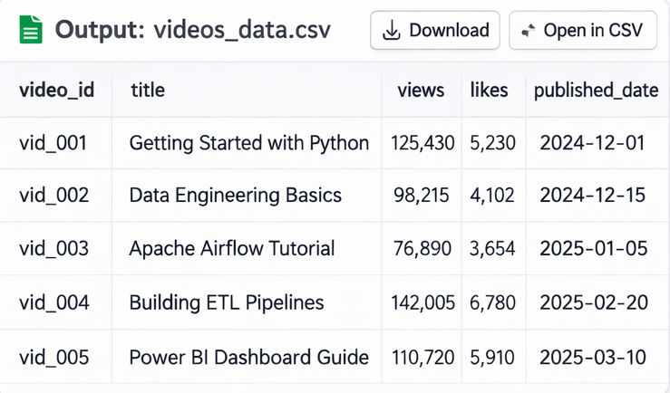
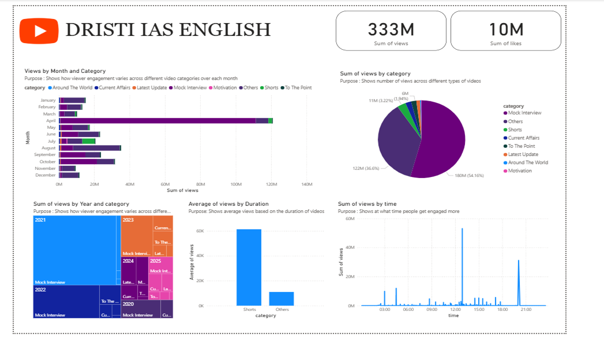

# 📊 Drishti IAS YouTube ETL Pipeline

---

## 🖼️ Architecture



---

## 🚀 Project Overview

This project is an end-to-end **ETL (Extract, Transform, Load) pipeline** that extracts data from the **Drishti IAS YouTube channel**, processes it using Apache Airflow, and loads it into AWS S3 for further analysis and visualization in Power BI.

---

## 🎯 Objective

- Automate YouTube data extraction  
- Track video performance  
- Maintain historical data  
- Build analytics-ready pipeline  

---

## 🧱 Tech Stack

- Python  
- Apache Airflow  
- Docker  
- YouTube Data API v3  
- Pandas  
- AWS S3  
- Power BI  

---

## 🔄 Workflow

YouTube API → Airflow → Extract → Transform → AWS S3 → Power BI


---

## 📁 Project Structure

```
drishti-ias-etl-pipeline/
│
├── dags/
├── scripts/
├── data/
│   ├── raw/
│   └── processed/
├── screenshots/
│   ├── architecture.png
│   ├── airflow_dag.png
│   ├── graph_view.png
│   ├── csv_output.png
│   └── powerbi_dashboard.png
├── docker-compose.yml
├── requirements.txt
├── .env
├── .gitignore
└── README.md
```


---

## 🔑 Environment Variables

Create `.env` file:

YOUTUBE_API_KEY=your_api_key
AWS_ACCESS_KEY_ID=your_key
AWS_SECRET_ACCESS_KEY=your_secret
AWS_DEFAULT_REGION=ap-south-1
S3_BUCKET_NAME=your_bucket


---

## 🔑 YouTube API Integration

- Uses **YouTube Data API v3**
- Fetches:
  - Video ID  
  - Title  
  - Views  
  - Likes  
  - Published Date  

---

## 🔑 How to Get API Key

1. Go to Google Cloud Console  
2. Create project  
3. Enable YouTube Data API v3  
4. Create API Key  
5. Add to `.env`  

> ⚠️ Without API key, pipeline will not run

---

## ▶️ How to Run

### 1. Clone Repo

git clone <your-repo-url>
cd drishti-ias-etl-pipeline


### 2. Add `.env`
- Add API + AWS keys  

### 3. Start Docker

docker-compose up -d


### 4. Open Airflow

http://localhost:8080


Login:

airflow / airflow


### 5. Trigger DAG
- Enable DAG  
- Click ▶️  

---

## 🔄 Pipeline Steps

### 📥 Extract
- Fetch data from YouTube API  
- Output:

data/raw/videos.csv


---

### ⚙️ Transform
- Data cleaning  
- New vs Old classification  
- History tracking  

Output:

data/processed/videos.csv
data/processed/history.csv


---

### ☁️ Load
- Upload processed data to AWS S3  

---

## 📸 Screenshots

### 🔹 Airflow DAG


---

### 🔹 Graph View


---

### 🔹 CSV Output


---

### 🔹 Power BI Dashboard


---

## 📊 Power BI

- Use `history.csv`  
- Create:
  - Views over time  
  - Top performing videos  
  - Growth trends  

---

## 🔐 Security

- `.env` used for secrets  
- API keys not exposed  
- `.gitignore` protects sensitive data  

---

## 🧠 Key Learnings

- ETL pipeline design  
- Airflow automation  
- API integration  
- Data transformation  
- AWS cloud usage  

---

---

## 👨‍💻 Author

Saril Pandey
